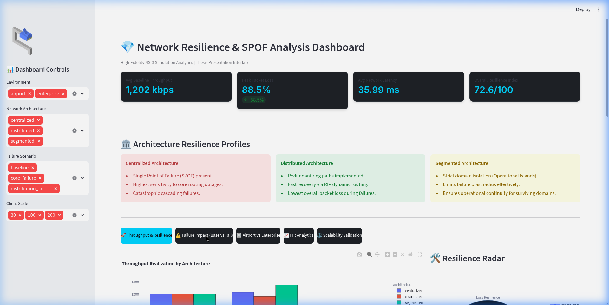

# Network Resilience & SPOF Analysis Dashboard



## Abstract
This repository contains a high-fidelity NS-3 network simulation and an interactive Streamlit analytics dashboard designed to evaluate network resilience. The project compares three distinct architectural models—Centralized, Distributed, and Segmented—under various failure scenarios and client loads. By simulating both standard Enterprise environments and mission-critical Airport domains, this research quantifies the impact of Single Points of Failure (SPOF) and validates domain isolation strategies using the novel Failure Impact Ratio (FIR) metric.

## Motivation
Modern operational networks face increasing risks from hardware failures, misconfigurations, and targeted disruptions. As networks scale, the blast radius of a single failure can catastrophically impact critical services. This research aims to mathematically model and visualize how different architectural topologies withstand core routing failures, providing empirical evidence to support segmented and distributed network designs over legacy centralized models.

## Research Questions
1. How does the presence of a Single Point of Failure (SPOF) degrade network throughput and packet delivery during core outages?
2. To what extent does dynamic routing (RIP) and ring redundancy mitigate failure impact compared to hub-and-spoke models?
3. How effectively does a Segmented architecture isolate failure domains and prevent cascading outages in multi-service environments (e.g., Airport FIDS, Baggage, Passenger networks)?
4. Does the relative resilience ranking of these architectures remain mathematically stable as client load scales from 30 to 200 nodes?

## Architecture Overview

### Centralized Architecture
A traditional hub-and-spoke model where all distribution switches connect to a single Core router.
*   **Characteristics:** Simplicity and ease of management.
*   **Vulnerability:** Single Point of Failure (SPOF) may exist at critical aggregation points. Resilience depends heavily on core-node availability.
*   

### Distributed Architecture
A resilient ring topology where multiple core routers are interconnected, utilizing RIP (Routing Information Protocol) for dynamic path calculation.
*   **Characteristics:** Multiple forwarding paths can improve fault tolerance. Dynamic routing may provide recovery after failures.
*   **Vulnerability:** Additional redundancy increases architectural complexity.

### Segmented Architecture
An advanced topology designed for mission-critical operations. Domains (e.g., Passenger, Operations) are assigned dedicated distribution and core routing paths with strict physical and logical isolation.
*   **Characteristics:** Traffic domains are isolated. Failure impact can be contained within affected segments.
*   **Vulnerability:** Requires extensive hardware provisioning.
*   

## Scenario Modeling: Airport vs Enterprise
The simulations were executed across two distinct domain models:
*   **Enterprise:** A standard 3-tier corporate network.
*   **Airport:** A 4-domain operational environment consisting of Passenger WiFi, FIDS (Flight Information Display Systems), Baggage Handling, and Operations networks. This model explicitly tests the efficacy of blast radius containment for critical services.

## Scalability Validation
To ensure findings are robust under congestion, networks were simulated across increasing client loads:
*   **Scale 30:** Baseline standard load.
*   **Scale 100:** High load, inducing queue saturation.
*   **Scale 200:** Stress load, pushing UDP buffers to maximum capacity.

## Failure Impact Ratio (FIR)
A key contribution of this project is the FIR metric, which normalizes the severity of a failure regardless of the baseline network performance.
`FIR = (Failure Packet Loss - Baseline Packet Loss) / Baseline Packet Loss`
This allows for direct resilience comparison across different scales and environments.

## Dashboard Features
The interactive Streamlit dashboard (`app.py`) serves as an academic presentation interface:
*   **Dynamic Data Parsing:** Processes NS-3 FlowMonitor XML outputs natively via Regex.
*   **Multi-Dimensional Filtering:** Slice data by Environment, Architecture, Failure Scenario, and Client Scale.
*   **Radar & Heatmap Analytics:** Visually compares throughput, delay, and loss resilience.
*   **FIR & Scalability Tracking:** Plots resilience degradation under increasing node counts.
*   **Data-Driven Interpretations:** Automatically generates academic observations based strictly on the active filter selection.

## Technologies Used
*   **NS-3 (Network Simulator 3):** C++ based discrete-event network simulator.
*   **Python 3:** Data extraction, processing, and visualization.
*   **Streamlit:** Interactive web dashboard framework.
*   **Plotly Express / Graph Objects:** Advanced charting and rendering.
*   **Pandas / Regex:** Data manipulation and filename metadata extraction.

## Repository Structure
```
NS3-Network-Resilience-SPOF-Analysis/
│
├── src/                  # NS-3 C++ Simulation Scripts
│   ├── airport.cc
│   └── enterprise.cc
│
├── dashboard/            # Streamlit Dashboard Application
│   ├── app.py
│   └── run_dashboard.sh
│
├── scripts/              # Python XML Parsers and Analyzers
│   ├── parse_flowmon.py
│   ├── analyze_thesis.py
│   └── analyze_scalability.py
│
├── results/              # NS-3 FlowMonitor Output Files (.xml)
├── screenshots/          # UI and Topology Visualizations
├── requirements.txt      # Python Dependencies
├── .gitignore            # Git Ignore Rules
└── README.md             # Project Documentation
```

## Installation
1. Clone this repository:
   ```bash
   git clone https://github.com/emrekaramann/NS3-Network-Resilience-SPOF-Analysis.git
   cd NS3-Network-Resilience-SPOF-Analysis
   ```
2. Create and activate a Python virtual environment:
   ```bash
   python3 -m venv venv
   source venv/bin/activate
   ```
3. Install the required dependencies:
   ```bash
   pip install -r requirements.txt
   ```

## Running Simulations
*(Note: Requires a functional NS-3 installation)*
To generate new simulation data, copy the `src/*.cc` files into your `ns-3-dev/scratch/` directory and run:
```bash
./ns3 run "airport --architecture=segmented --failure=core_failure --clients=100"
```

## Running Streamlit Dashboard
The dashboard relies on the `.xml` files located in the `results/` directory. To launch the analytics interface:
```bash
cd dashboard
streamlit run app.py
```
Or use the provided wrapper script:
```bash
./dashboard/run_dashboard.sh
```

## Sample Results
*(Data driven dynamically from the dashboard. Sample observation from Scale 100 Airport tests):*
*   **Centralized:** Experienced the largest increase in packet loss following a core failure.
*   **Distributed:** Demonstrated improved resilience through redundant routing paths and route reconvergence.
*   **Segmented:** Limited the operational impact of failures by isolating affected service domains.

## Future Work
*   Integration of TCP flows alongside UDP OnOff applications to study congestion control behavior during core failures.
*   Implementation of SDN (Software Defined Networking) controllers to compare dynamic traffic engineering against traditional RIP convergence.
*   Addition of wireless propagation models for the Passenger WiFi domain.

---
*Developed as part of academic research on Network Architecture & Resilience.*
